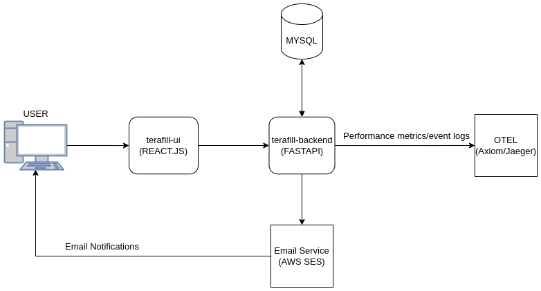

# terafill-backend

## Architecture




## Developer guide


**Setting up environment variables**

Environment variables are by default picked up from **.env.local** file if running this setup locally. This file will look something like this:

```shell
AWS_ACCESS_KEY_ID="<AWS_ACCESS_KEY_ID>"
AWS_SECRET_ACCESS_KEY="<AWS_SECRET_ACCESS_KEY>"
AWS_REGION_NAME="<AWS_REGION>"

MYSQL_HOST="127.0.0.1"
MYSQL_PORT=3306
MYSQL_USER="terafill_backend"
MYSQL_PASSWORD="terafill_backend_123"
MYSQL_DB="terafill"

AXIOM_API_TOKEN="<AXIOM_API_TOKEN>"
AXIOM_ORG_ID="<AXIOM_ORG_ID>"

HOST="http://0.0.0.0:8000"
```


**Setting up OTEL(Open telemetry)**

A local jaeger instance can be spawned locally in order to ingest performance metrics and event logs.

```shell
make run_otel_local
```


**Setting up Mysql Database**

Build docker image

```shell
docker build -f db.Dockerfile -t terafill-mysql .
```

Run docker image 

```shell
docker run -p 3306:3306 terafill-mysql
```


**Setting up python environment**

Create a virtual python environment and install required packages

```
pip install requirements.txt
```


**Run the backend application service locally**

``` 
make run_local
```


 


